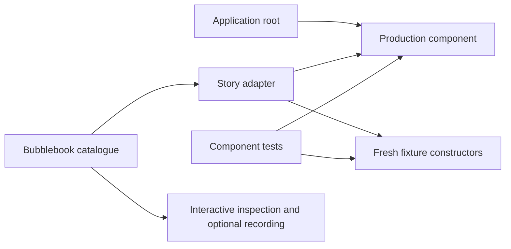
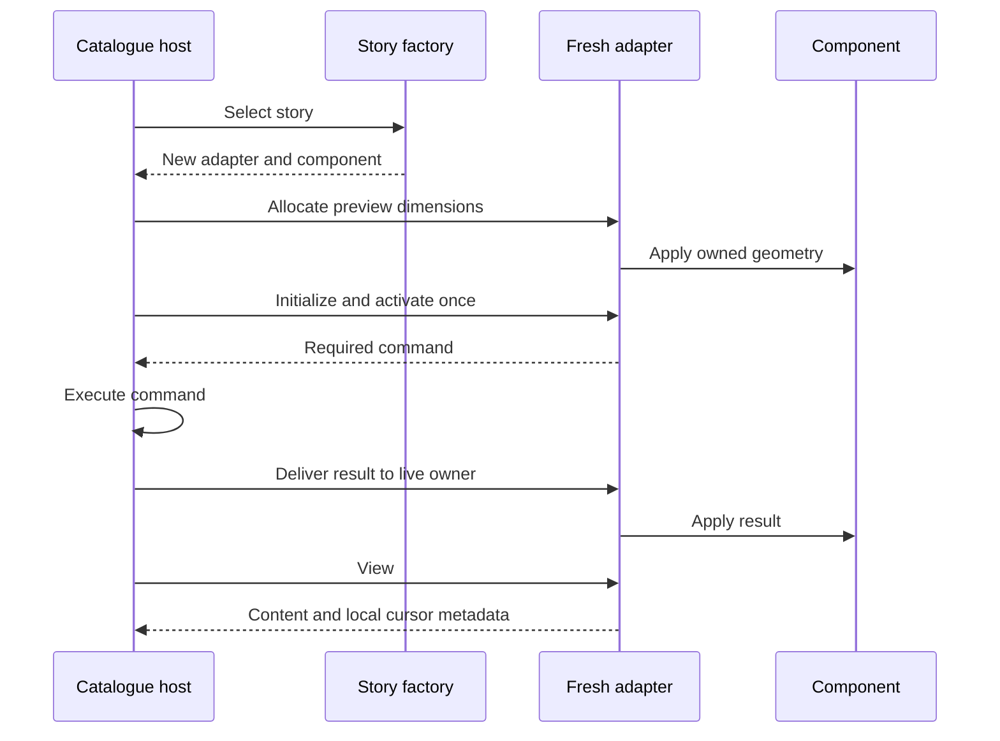

# Bubblebook stories

[meza/bubblebook](https://github.com/meza/bubblebook) is the native Bubble Tea v2
development host for this skill's components. The selected
architecture is native v2 throughout: production application, Bubbles widgets,
story adapters, and catalogue host. The host receives factories that construct
fresh v2 story models. Each story wraps the actual component through its public
contract.

## Project integration

Use `https://github.com/meza/bubblebook` as the Bubblebook source, with the
project's pinned version or commit and the module path declared by that source.
Read its actual resolved source, including any `replace` directive, for its Go
requirement, factory API, and registration API. Record the dependency and
catalogue invocation in the consuming project's documentation. Do not invent a
dependency URL, version, install command, or registration API.

## Dependency direction

The production application and the development story adapter both depend on the
component. The adapter also depends on fixture constructors. The catalogue entry
point registers those adapters with the selected Bubblebook version. Bubblebook
and fixtures never become imports of the production component or application.

Keep story adapters and fixture helpers in ordinary development Go packages so
both the catalogue and tests can import them. A declaration in a `_test.go` file
cannot supply the runnable catalogue. Preserve the project's existing package
layout; do not create a published component module merely to demonstrate local
reuse. A reusable library still keeps stories outside its production API.

For example, inside the consuming application's existing Go module:

```text
internal/ui/results/
    results.go             # component state and operations
    render.go              # deterministic rendering
    styles.go              # semantic style values
    results_test.go        # direct contract assertions
internal/uifixture/
    results.go             # fresh data and controlled inputs
internal/uistory/
    results.go             # thin tea.Model adapter and named factories
cmd/bubblebook/
    main.go                # registration and host entry point
testdata/results/
    populated.golden       # expected output owned by rendering tests
```

These are example locations, not required scaffolding. Keep golden files relative
to the tests that own them; pass that location explicitly when their test harness
does not use a conventional local `testdata` directory.



The arrows mean imports or use. Fixtures are development inputs; they are never
an application dependency. An error fixture supplies an error through the normal
component boundary rather than drawing an imitation error panel.

The thin story model translates host events into the component's operations,
propagates commands, and constructs `tea.View` from its actual output. It owns
only the local orchestration needed to demonstrate that component. Application
business logic stays in the component or its appropriate domain owner, so a
story cannot quietly become an alternate implementation.

## Host contract to verify

### Worked fixture and story adapter

This example hosts the `Results` API from the [complete Results example](results-example.md).
Read that example, including its input, style, and ownership assumptions, before
using or reviewing this adapter.
The two Go blocks are complete example files once that component is placed at
`internal/ui/results`. Replace the illustrative `example.com/project` module
prefix with the consuming project's module path. Palette choices belong to these
development fixtures; the component receives styles as values.

```go
package uifixture

import (
    "example.com/project/internal/ui/results"
    "charm.land/lipgloss/v2"
)

func PopulatedResults() *results.Results {
    return results.NewResults([]results.Item{
        {ID: "alpha", Label: "Alpha"},
        {ID: "beta", Label: "Beta"},
        {ID: "unicode", Label: "日本語 and café"},
    }, ResultsStyles())
}

func EmptyResults() *results.Results {
    return results.NewResults(nil, ResultsStyles())
}

func ResultsStyles() results.ResultsStyles {
    return results.ResultsStyles{
        Normal: lipgloss.NewStyle(),
        Selected: lipgloss.NewStyle().Bold(true),
        Empty: lipgloss.NewStyle().Italic(true),
    }
}
```

Each call creates its own component and slice. A test can call
`uifixture.PopulatedResults()`, move selection, and assert that the selected ID is
`beta`; the story uses the same inputs without sharing mutable test state.

```go
package uistory

import (
    "example.com/project/internal/ui/results"
    "example.com/project/internal/uifixture"
    tea "charm.land/bubbletea/v2"
)

type resultsStory struct {
    component *results.Results
    width int
    height int
}

func PopulatedResults() tea.Model {
    return &resultsStory{component: uifixture.PopulatedResults(), width: 40, height: 8}
}

func EmptyResults() tea.Model {
    return &resultsStory{component: uifixture.EmptyResults(), width: 40, height: 8}
}

func (story *resultsStory) Init() tea.Cmd { return nil }

func (story *resultsStory) Update(message tea.Msg) (tea.Model, tea.Cmd) {
    switch message := message.(type) {
    case tea.WindowSizeMsg:
        story.width = max(0, message.Width)
        story.height = max(0, message.Height)
    case tea.KeyPressMsg:
        switch message.String() {
        case "up":
            story.component.Move(-1)
        case "down":
            story.component.Move(1)
        }
    }
    return story, nil
}

func (story *resultsStory) View() tea.View {
    return tea.NewView(story.component.Render(story.width, story.height))
}
```

The host sends the allocated preview size, not the terminal's full dimensions,
and forwards keys only while the preview owns input. This static component has
no asynchronous work and no real cursor, so returning `nil` commands and a
content-only view is intentional. An editor or loading component must preserve
its commands and cursor metadata instead of copying those simplifications.
The adapter uses the native [Bubble Tea model and view contract](https://github.com/charmbracelet/bubbletea/blob/main/tea.go)
and [key event API](https://github.com/charmbracelet/bubbletea/blob/main/key.go).

At the catalogue entry point, register `uistory.PopulatedResults` under
`Results/Populated` and `uistory.EmptyResults` under `Results/Empty` through the
project's Bubblebook registration API. Pass the functions themselves as factories;
do not call them once and capture a shared model. Registration belongs to that
entry point, not the component or fixture package.

### Activation and command flow



The sequence shows a size-before-activation contract. Follow the host's documented
ordering and make initialization independent of size when it uses another order.
Never use a concurrent batch to enforce size-before-work: the dependency must
already be satisfied before creating the effect.

A common command-loss bug is treating forwarding as a call with no result:

```go
// Incorrect preview excerpt: the child command is discarded.
preview.child, _ = preview.child.Update(sizeMessage)

// Correct forwarding excerpt: store the returned model and propagate its command.
var cmd tea.Cmd
preview.child, cmd = preview.child.Update(sizeMessage)
return cmd
```

Here `sizeMessage` is a `tea.WindowSizeMsg` containing the preview's computed
content allocation, and `preview.child` is its hosted `tea.Model`. This excerpt
describes the host boundary, not a helper to duplicate inside every story. The
parent invoking this forwarding operation must return or combine its command.

### Integration checklist

Verify these host integration requirements:

| Boundary | Required behavior |
| --- | --- |
| Factory | Every invocation creates independent mutable state and controlled dependencies without I/O. |
| Start | Initial allocation, initialization, and activation have documented ordering; activation-owned work starts once per activation. Later commands follow user actions or result messages. |
| Resize | The preview computes a content allocation once, resizes the story once, and preserves any returned command. |
| Input | The catalogue owns navigation shortcuts; preview focus determines story input. Underlying controls do not consume intercepted input. |
| Async work | Tick and result messages reach the correct live story; an old story's result cannot change its replacement. |
| View | Content is placed in the preview region; cursor coordinates and required v2 metadata are composed deliberately. |
| Terminal policy | The catalogue root controls terminal-wide modes. A story cannot accidentally change the whole host's mode or quit it. |
| Replacement | Changing stories cancels work that supports cancellation, stops scheduling the old story's recurring work, resets local state, and restores the intended focus. |

For a real Bubbles control, verify editing or scrolling and any cursor/tick
behavior in the preview, not merely that the story builds. If a required host
capability is missing, describe the failure and hand the needed correction to the
host's owner.
Do not recreate the host's private lifecycle inside every story as a workaround.

## Fixtures and named states

Fixtures express a component state and its inputs; they do not duplicate the
component's transition logic. Repeated construction yields equivalent values
with separate mutable storage. Side-effectful components receive controlled
services so browsing a story cannot unexpectedly call production systems.

Name stories by component and meaningful state. Include the relevant states
among empty, populated, focused, loading, error, disabled or read-only, narrow,
long styled Unicode content, and supported themes. Avoid a mandatory matrix of
states a component cannot actually exhibit. Loading and error fixtures remain
inspectable, rather than racing away through live network calls.

State and render tests consume the same fixture inputs as the stories. Tests
exercise actual operations and independently stated outcomes. They do not assert
correctness by reproducing the implementation's calculations in the fixture.

| Story | Controlled setup | What to inspect |
| --- | --- | --- |
| `Results/Empty` | No items | Empty message fits; arrows do not create a selection |
| `Results/Populated` | Stable IDs and order | Selection marker, boundaries, selected row remains visible |
| `Results/Narrow` | Same data in a tiny preview | Truncation, no overflow, state survives enlargement |
| `Results/Unicode` | Long single-line Unicode labels | Cell widths and truncation preserve text integrity |
| `Search/Loading` | Controlled pending service | Loading remains inspectable; navigation still works |
| `Search/Error` | Deterministic failure | Error text and retry action, without live service access |
| `Editor/Focused` | Host gives preview input | Editing and real cursor placement agree |
| `Editor/ReadOnly` | Read-only component state | Content remains visible; editing is rejected |
| Theme variants | Explicit semantic styles | State is understandable in each supported theme |

The Results example supports the first four rows. Search and Editor rows show
which additional stories to add when those components exist; do not add fake
loading, disabled, or cursor state to Results merely to fill a catalogue matrix.

## Daily component workflow

1. Define the behavior and one fixture that makes it visible. For Results, three
   stable items and a two-row viewport expose selection and scrolling together.
2. Implement and directly test the public operations. Assert observable selected
   IDs and output bounds, as shown in [Testing](testing.md).
3. Add a fresh story factory and register a meaningful name. Build the catalogue
   using the consuming project's documented command.
4. Inspect the story: move through boundaries, shrink and enlarge the preview,
   leave and reselect it, then compare supported styles. Reselection starts fresh.
5. Connect the same component to the application root and test its routing.
   Correct local behavior does not prove the application's focus policy.
6. When a visual defect is found, preserve the smallest fixture that exposes it
   and add the appropriate geometry or behavior assertion before accepting the
   presentation change. Record a VHS demo only when documentation needs it.

## Verification evidence

For catalogue integration, build and run the registered stories with the pinned
host. Check fresh state on reselection, preview focus, keyboard/mouse routing
where supported, repeated and tiny resizes, command completion, and replacement
while work is in flight. Verify the full preview's content and cursor positions.

Keep component tests outside the catalogue host. Host-specific integration tests
protect the adapter boundary and the lifecycle contract above. Pin terminal size,
profile, theme, and any time/data inputs for automated visual comparisons. Human
inspection checks usability and appearance in addition to deterministic tests.

Report the actual host revision and checks completed. If the catalogue has not
run, distinguish passing component tests from unverified catalogue execution.
