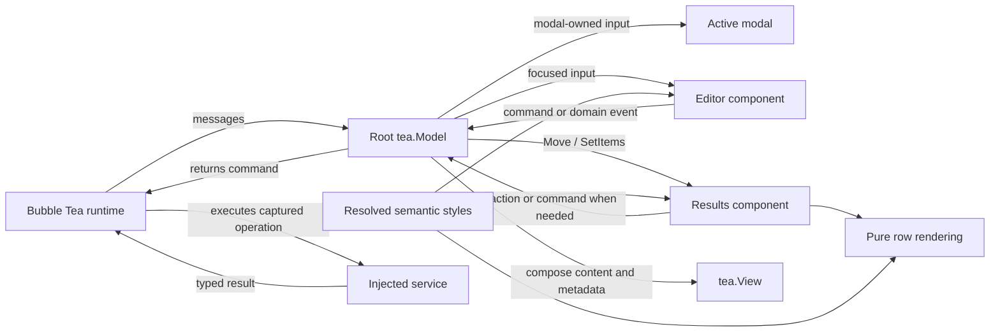

# Component design and message ownership

Use this reference to turn a UI requirement into component contracts and an
application update path. The selected design is one root `tea.Model`, narrow
stateful components, pure renderers, and development-only Bubblebook adapters.
The examples below teach that design; they are not a new component framework.

## Read the material for the task

Read this file for component boundaries, state ownership, composition choices,
and capability interfaces. For design, implementation, review, or investigation,
read each applicable linked reference in full. Do not reread material already read
for the current task:

| Concern | Required reference |
| --- | --- |
| A concrete stateful component, selection, or the shared Results example | [Results example](results-example.md) |
| Keyboard, mouse, modal, resize, or theme routing | [Input routing](input-routing.md) |
| Commands, asynchronous results, request identity, errors, or ordering | [Effects and ordering](effects-and-ordering.md) |
| Construction, activation, focus, disposal, or native Bubbles integration | [Lifecycle and Bubbles](lifecycle-and-bubbles.md) |

For a new component, read every reference applicable to its behavior. For a task
spanning concerns, read all applicable references; a route to one does not replace
the others. The Results example also supplies the component used by the capability
interface discussion below.

## Translate composition into explicit contracts

The useful part of the React analogy is ownership and composition. Bubble Tea
is based on The Elm Architecture: `Init` supplies initial commands, `Update`
handles messages and returns the next model and command, and `View` describes
the presentation. In v2 the root returns `tea.View`. Bubble Tea does not supply
a DOM, hooks, or reconciliation.

| Familiar concept | Contract in this system | Example |
| --- | --- | --- |
| Props | Constructor inputs or purpose-specific setters | `SetItems(items)` |
| Local state | Private fields with protected invariants | Selection stays within the available items |
| Parent-to-child interaction | Direct synchronous operation | `results.Move(1)` |
| Child-to-parent output | Return a value or typed action | `Selected() (Item, bool)` |
| Effects | Captured inputs and injected dependency inside a command | Search returns `searchLoadedMsg` |
| Render | Explicit data, styles, and allocated dimensions | `Render(width, height)` |
| Theme/context | Resolved semantic values passed at construction or update | `ResultsStyles` |
| Mount/unmount | Explicit activation and disposal owned by the parent | Start work once; invalidate it on replacement |
| Identity | Stable item identity and explicit async owner/request identity | Item ID is distinct from selection index |

Classify state before choosing its owner. These are responsibilities, not a
requirement to create three structs for every component.

| State | Example | Owner and reason |
| --- | --- | --- |
| Domain | An item's ID and label; persisted document contents | Domain/service boundary defines meaning; UI receives a snapshot |
| Orchestration | Active route, modal, allocated focus, current search request | Root coordinates competing parts of the screen |
| Local interaction and presentation | Selected row, scroll position, editing cursor, resolved style values | Component protects its own behavior and rendering invariants |

A search editor can own its editable query while the root captures a query
snapshot for a request. Those values represent different moments, so they are not
two editable authorities. In contrast, an independently editable parent selection
index and child selection index will eventually disagree. Read selection through
the component's contract.

Determinism covers state transitions and command intent as well as rendering.
Given the same component state, input message or configuration, dimensions, and
theme, the component should produce the same next state, intended commands, and
rendering. A command's eventual network response need not be predictable; the
decision to issue that request and its captured inputs should be. Put time,
filesystem access, networking, randomness, and terminal-environment detection
behind commands or explicit injected dependencies so those inputs can be
controlled in tests.

## Why this composition path

The research compares several valid ecosystem patterns. This skill makes their
roles explicit so implementation does not reopen the architecture choice for
every pane.

| Research pattern | Mechanics and strengths | Principal risks or costs | Fit identified in the research | Role in this skill |
| --- | --- | --- | --- | --- |
| Root plus stateful leaves | Root owns routing/focus/layout; leaves expose operations and rendering. Explicit ownership, easy input interception, efficient dispatch | Root can become large; leaf APIs need discipline | Large coordinated UIs; preferred default for Crush-like applications | Application architecture; split root coordination into cohesive methods/files |
| Pure renderer | Data, styles, and width produce output. Easiest to test, reuse, and cache | Parent must own all interaction state | Labels, cards, list items, tool renderers; preferred where local interaction state is unnecessary | Labels, rows, summaries, and other display-only elements |
| Narrow core plus model adapter | Narrow core wrapped in a standalone model. Testability and isolated Bubble Tea/Bubblebook hosting | One more layer to maintain | Reusable packages and design systems | Bubblebook boundary wraps the production component |
| Nested model tree | Parent stores models and forwards messages/commands. Familiar Bubble Tea abstraction and independently runnable children | Message fan-out, lifecycle ambiguity, duplicated global handling, focus complexity | Medium applications and genuinely autonomous widgets | Retain native Bubbles contracts inside their owner; do not give each custom pane a broad message loop |
| Full-screen model stack | Controller pushes/pops screens. Strong screen isolation and simple navigation | Poor fit for simultaneous panes; shared state transfer needs attention | Wizards and full-screen navigation | Express navigation in the root and delegate screen behavior through narrow operations |
| Screen buffer plus string leaves | Parent allocates regions; leaves draw or render into them. Precise clipping/layout and performance | More rendering infrastructure | Complex high-throughput TUIs at Crush scale | Outside the default string/Lip Gloss path; establish a concrete requirement before changing the rendering architecture |

The single-root/narrow-operation choice is informed by
[Crush's UI composition guidance](https://github.com/charmbracelet/crush/blob/main/internal/ui/AGENTS.md).
It is this skill's selected architecture, not a claim that every Charm project
must use it.



User input follows focus and modal policy. Result messages follow the identity of
their live owner. A modal appearing must not prevent a background search result
from reaching the screen that requested it.

## Keep interfaces as small as their consumers

These illustrative capability interfaces are defined by a consumer that actually
needs to operate on several component types. They are not a mandatory base class:

```go
type Renderable interface {
    Render(width, height int) string
}

type Focusable interface {
    Focus() tea.Cmd
    Blur()
    Focused() bool
}

type Expandable interface {
    Expanded() bool
    SetExpanded(bool)
}
```

The `Results` example satisfies only `Renderable`; focus policy remains in its
parent because movement is already explicitly routed. A consumer needing only
rendering should not acquire focus or expansion authority. Keep concrete types
when there is only one implementation and no useful consumer boundary.

Read [the Bubblebook reference](bubblebook.md) to expose a fresh instance through
a story adapter, [testing](testing.md) to choose assertions for selection,
geometry, routing, and effect lifetimes, and
[performance and debugging](performance-and-debugging.md) for measured hot paths.
