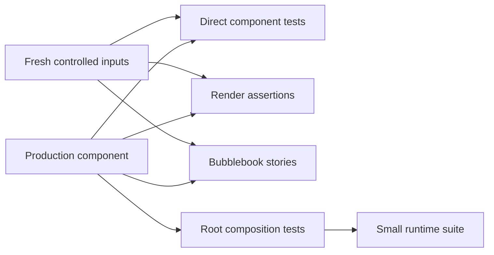

# Test the component and its host

Read this when designing tests for a Charm component or investigating an
interaction regression. Use the component from [SKILL.md](../SKILL.md) through
its narrow operations. Test root routing separately, then use a small runtime
suite for behavior that depends on Bubble Tea delivering commands and events.

## Choose the observation point

| Layer | What it proves | Harness | Controlled inputs | Useful assertions |
| --- | --- | --- | --- | --- |
| Component state | Selection, validation, loading, retry, stale results | Direct operations with `testing` | Fresh component and injected dependencies | Public state and returned actions |
| Rendering | Width, height, selected/error/empty appearance | Direct `Render` | Dimensions, styles, data | Cell bounds, exact output, golden |
| Component contract | Reusability across parents and stories | Factory-driven cases | Fresh inputs and dimensions | Isolation, repeatability, focus and resize behavior |
| Root composition | Modal precedence, focus and result ownership | Root `Update` with synthetic messages | Explicit initial root state | Only the intended component changes |
| Bubble Tea runtime | Commands return to the loop and input produces a journey | `teatest/v2` | Fixed terminal, theme, bounded effects | Intermediate output and final model |
| Bubblebook story | Human assessment of interaction and appearance | Named fresh story factory | Shared fixture | Cursor, focus, spacing, edge states |
| Application smoke | A critical journey through real composition | Small runtime or manual suite | Controlled configuration and backend | User-visible completion and failure |

Most coverage belongs in the first four rows. A selection clamp does not need a
terminal process. A bug caused by losing a command at a hosting boundary does
need a check that crosses that boundary.

## Read the applicable test guides

For design, implementation, review, and regression investigation, select the
layers above before choosing checks. Read every guide that applies to the
behavior being changed or reviewed; a task can require several guides.

| Work in scope | Required guide |
| --- | --- |
| Component state, public operations, isolation, focus, or style overrides | [Component contract tests](testing-components.md) |
| Commands, asynchronous results, loading, retry, cancellation, or time | [Effect and time tests](testing-effects.md) |
| Rendering, geometry, cursor output, fixtures, or golden expectations | [Rendering tests](testing-rendering.md) |
| Parent routing, focus, modals, resize, lifecycle, or result ownership | [Root routing tests](testing-routing.md) |
| Real runtime scheduling, event delivery, or an application smoke journey | [Runtime integration tests](testing-runtime.md) |

Run component tests first, root integration next, and the relevant runtime
journey last. Use the [tooling and diagnostics reference](performance-and-debugging.md)
for race checks and performance investigation. Inspect the same fresh fixture
states in [Bubblebook](bubblebook.md) for human interaction review.
