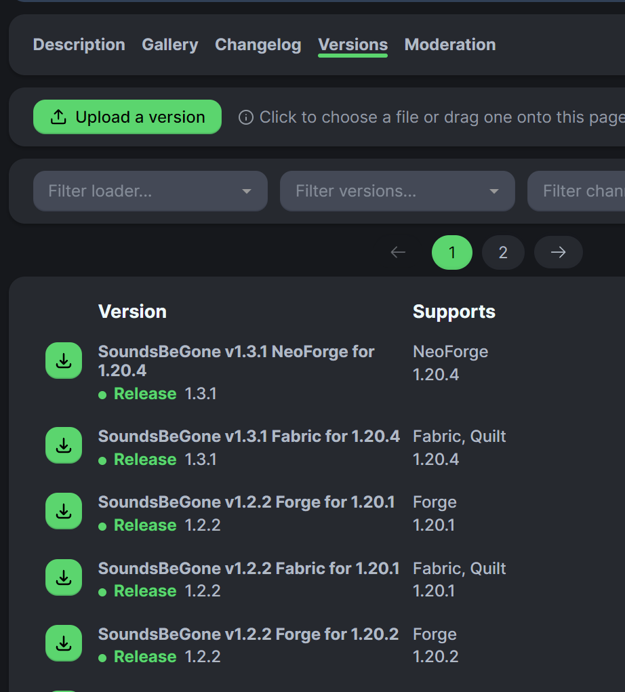
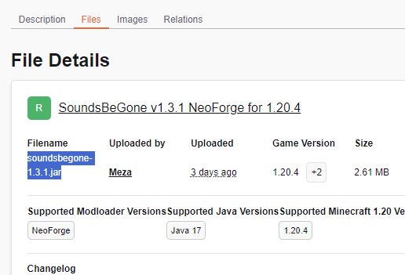
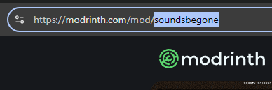

# `mmm add`

> This guide describes the Go-port target defined in [product intent](../intent.md), not a claim that every released build already implements it.

`add <platform> <id>` creates a mod config for an explicitly selected CurseForge or Modrinth project and reconciles its jar into the managed installation.

See [shared command behavior](README.md), especially [modlist and setup](README.md#modlist-and-setup), [file ownership and exclusions](README.md#file-ownership-and-exclusions), and [results and retry](README.md#results-and-retry).

```bash
mmm add modrinth AANobbMI
```

## Usage and options

```text
mmm add <platform> <id> [options]
```

| Option | Meaning |
| --- | --- |
| `--version <version>` | Request an exact pin. Use a Modrinth version number or a CurseForge artifact filename. |
| `--unpin` | Explicitly clear an existing pin and select the newest eligible artifact. |
| `--allow-version-fallback` / `--allow-version-fallback=false` | Set or clear this mod's permission to use an artifact for the nearest earlier Minecraft release in the same release series. |
| `--release-types <types>` | Set this mod's nonempty comma-separated override from `alpha`, `beta`, and `release`. |
| `--force` | Save a verified project's requested mod config when no eligible artifact resolves. |

`--release-types` changes only this mod. It does not alter the installation-wide default. For example, this permits a beta for one project while the rest of the installation remains release-only:

```bash
mmm add modrinth AANobbMI --release-types release,beta
```

`--unpin` and `--version` cannot be combined. Invalid input makes no changes.

For an existing mod config, explicitly supplied settings replace the matching settings when the request resolves or force authorizes an unresolved mod config. Omitted settings are preserved. If no per-mod release override exists, omitting `--release-types` continues to inherit the modlist default. Repeating an already-satisfied addition does not duplicate its mod config or lock entry.

## Platforms

Supported platforms are `curseforge` and `modrinth`. A project keeps its chosen platform association unless you explicitly change it.

## Installing specific versions

Modrinth pins use the version number displayed by Modrinth, which may differ from the jar filename:

```bash
mmm add modrinth FOIvwGKz --version 1.3.1
```



Use the version number shown beneath the artifact title. In this example, the displayed pin is `1.3.1`, even though the title includes `v1.3.1` and loader and Minecraft details.

CurseForge does not provide one consistent mod-version value, so CurseForge pins use the complete artifact filename shown on its Files page.

1. Open the project's **Files** tab and select the required artifact.
2. On **File Details**, copy the complete value labelled **Filename**.


The Files tab helps you open the artifact that matches the required Minecraft version and loader.



Use the selected filename value, such as `soundsbegone-1.3.1.jar`, as the CurseForge pin.

If a requested pin resolves but its download fails, MMM keeps the new requested pin in the mod config, preserves the previous working jar and its recovery evidence, and reports that the installed state does not yet satisfy the mod config. A later `mmm install` can retry. The previous jar is not treated as satisfying the new pin.

If a first-time addition identifies a valid project and resolves an artifact but downloading it fails, the confirmed project remains declared so a later `install` can finish. An invalid or unconfirmed identity is not saved.

## Lookup and eligibility results

The recovery path depends on what MMM established:

- An invalid platform value is invalid input. Interactive execution opens that field for correction; unattended or redirected execution reports it and makes no changes.
- If the platform confirms that the project does not exist, or an ordinary request without `--force` finds that the project exists but no artifact satisfies the current Minecraft version, loader, release types, pin, and fallback settings, an interactive run offers to modify the search. The default answer is No.
- Authentication errors, timeouts, and service failures that remain after automatic retries stop the addition. They do not prove that a project or artifact is absent and therefore do not open search correction.

When search correction is accepted, the platform selector starts on the other platform, keeps the failed ID prefilled, and retains all other constraints. You may choose either platform and edit the ID before retrying. The flow can repeat after another confirmed miss. It edits only platform and ID; it does not loosen release types, pins, Minecraft version, loader, or fallback permission.

Without prompting, unresolved lookups are reported without opening correction controls.

If an ordinary first-time request has no eligible artifact and you decline search correction, MMM saves no mod config. If an existing project is pinned to A and requested pin B cannot resolve, MMM preserves A unless `--force` explicitly authorizes saving the unresolved request.

## Forced mod config without a resolved artifact

`add --force` can save a verified project's mod config and its requested constraints even when no eligible artifact resolves. It can also record an explicitly requested unresolved pin for an existing mod config.

MMM preserves any previous working artifact and valid recovery evidence. It does not invent a lock entry or claim an installation. The result reports that the mod config was saved but installation remains incomplete, with a non-success outcome. Adjust the mod config if needed, then retry with `mmm install`.

Force does not save an invalid or unverified project, relax lookup constraints, bypass integrity checks, override `.mmmignore` or `.disabled` exclusions, or authorize overwriting an unrelated file.

## How to find the mod ID

For CurseForge, use the numeric project ID shown on the project page:

```bash
mmm add curseforge 306612
```


The numeric ID appears in the **About Project** panel.

For Modrinth, use the project ID or slug accepted by Modrinth, such as the final segment of the project URL:

```bash
mmm add modrinth AANobbMI
```



In this example, the URL ends in `soundsbegone`, which is the project slug.
